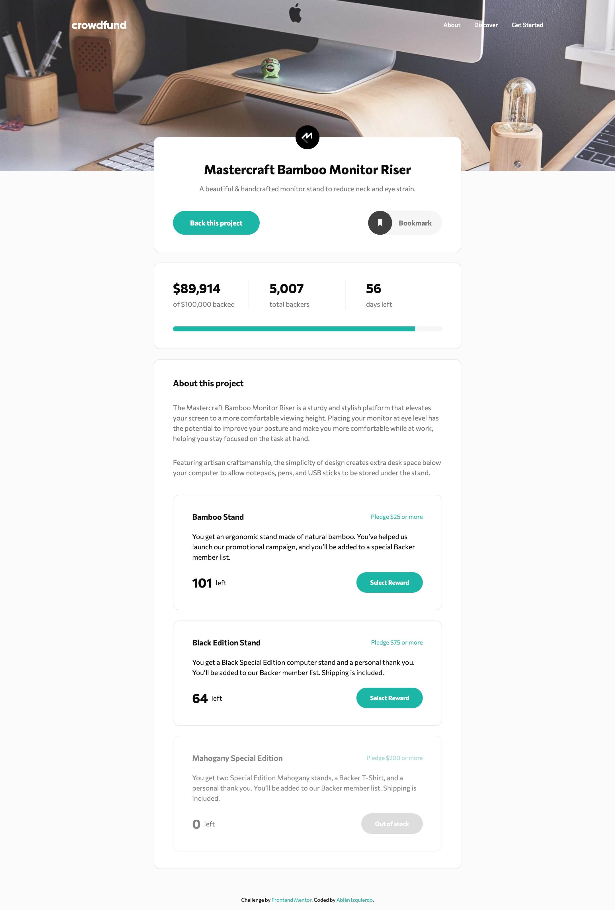

# Frontend Mentor - Crowdfunding product page solution

This is a solution to the [Crowdfunding product page challenge on Frontend Mentor](https://www.frontendmentor.io/challenges/crowdfunding-product-page-7uvcZe7ZR). Frontend Mentor challenges help you improve your coding skills by building realistic projects.

## Table of contents

- [Frontend Mentor - Crowdfunding product page solution](#frontend-mentor---crowdfunding-product-page-solution)
  - [Table of contents](#table-of-contents)
  - [Overview](#overview)
    - [The challenge](#the-challenge)
    - [Screenshot](#screenshot)
    - [Links](#links)
  - [My process](#my-process)
    - [Built with](#built-with)
  - [Author](#author)

## Overview

### The challenge

Users should be able to:

- View the optimal layout depending on their device's screen size
- See hover states for interactive elements
- Make a selection of which pledge to make
- See an updated progress bar and total money raised based on their pledge total after confirming a pledge
- See the number of total backers increment by one after confirming a pledge
- Toggle whether or not the product is bookmarked

### Screenshot

### Links

- Solution URL: [https://github.com/abizmo/crowdfunding-product-page](https://github.com/abizmo/crowdfunding-product-page)
- Live Site URL: 

## My process

### Built with

- Semantic HTML5 markup
- CSS custom properties
- Flexbox
- CSS Grid
- Mobile-first workflow
- [React](https://reactjs.org/) - JS library
- [Astro](https://astro.build/) - Web framework
- [TailwindCSS](https://tailwindcss.com/) - For styles
- [Shadcn/ui](https://shadcn.ui/) - Component library

## Author

- Website - [Abián Izquierdo](https://www.abizmo.dev)
- Frontend Mentor - [@abizmo](https://www.frontendmentor.io/profile/abizmo)
- Github - [@abizmo](https://www.github.com/abizmo)
